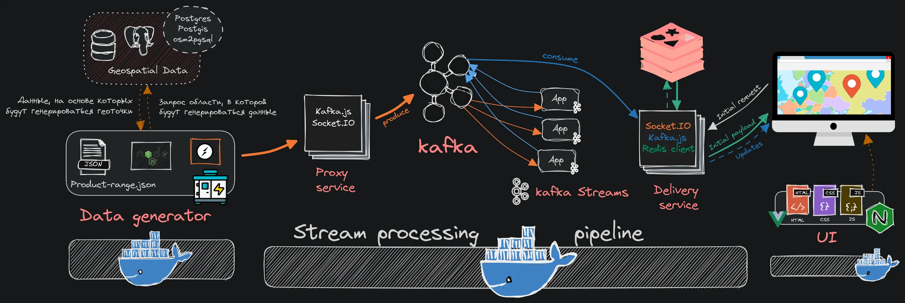

# Обзорный репозиторий для учебного стримингового пайлайна

## Содержимое:

1. [Быстрый запуск](#1-быстрый-запуск-всего-и-сразу-по-1-экземпляру-каждого-контейнера)
2. [Ссылки на репозитории всех компонентов пайплайна](#2-ссылки-на-репозитории-компонентов-пайплайна)
3. [Описание проекта](#3-описание-проекта)

---

## 1) Быстрый запуск всего пайплайна (_по 1 экземпляру каждого контейнера_)

Системные требования: от 20 до 30 Гб RAM.

---

### Первый вариант запуска, быстрый.

**Установка:**

-   Выполнить команду `curl <raw-url-of-compose.yaml> -o docker-compose.yaml && docker-compose up`
-   Или скопировать вручную и запустить `docker-compose.yaml` из этого репозитория.

UI будет доступен по адресу: **`localhost:80`**. Карта - интерактивная, маркеры - кликабельны

**Плюс** - быстро разворачивается

**Минус** - точки будут сгенерированы рандомно по всему земному шару (так как в этом варианте не используется основная фишка генератора(_генерация в определенной области. О чем речь - **см. 3.1**_)).

---

### Второй вариант запуска (как задумано).

В отличие от первого варианта, нужно препарировать геоданные для генератора \
UI будет доступен по адресу: **`localhost:80`**. Карта - интерактивная, маркеры - кликабельны

## 2) Ссылки на репозитории компонентов пайплайна:

-   [Генератор](https://github.com/murningstar/pipeline-gisGenerator "Generator repository")
-   [Proxy-сервис, Kafka, Delivery-сервис](https://github.com/murningstar/pipeline "Proxy, Kafka, Delivery repositories")
-   [Kafka Streams](https://github.com/murningstar/pipeline-processing-kstreams "Kafka streams processor's repository")
-   [UI](https://github.com/murningstar/pipeline-ui-vuemaplibre "UI repository")

## 3) Описание проекта

Обзорное изображение работы пайплайна:

Этот пайплайн - это мой pet-проект, который я сделал чтобы разобраться с технологиями и подходами из больших данных, да вообще с it-технологиями в целом. \
**Проект состоит из нескольких компонентов**:

1. Генератора данных. Чтобы хоть как-то соответствовать контексту потоковой обработки, этот поток должен откуда-то взяться(_то есть, что-то же нужно обрабатывать_). Для этого я сделал генератор продаж розничных магазинов, который генерирует чеки с товарами и ценами и отправляет эти данные в сам пайплайн.
2. Прокси-сервиса. Этот сервис принимает данные от генератора и отправляет их в топик кафки.
3. Kafka. (Выбрал кафку в качестве брокера или скорее механизма буферизации)
4. Kafka Streams. Делает примитивную потоковую обработку.
5. Сервис доставки обработанных сообщений фронт-енду
6. Сам front-end клиент (отображение обработанных сообщений на карте) + положил статику в nginx.

Подробнее про каждый компонент по отдельности:

### Генератор

Его суть заключается в генерации продаж. Так как я захотел, чтобы результат работы пайплайна отображался на карте, то данные должны как-то отличаться по географическому признаку. В итоге я сделал так, что перед началом генерации продаж приложение генерирует случайные геолокации для каждого магазина. \
При разработке генератора мне захотелось поковырять всякие **GIS-технологии** и по итогу получилось следующее:

-   В самой генерации используются следующие вещи: Posgres база с Postgis плагином(_плагин нужен для хранения гео-информации с Openstreetmaps_), утилита osm2pgsql(_для загрузки гео-датасета в postgres_).
-   Геолокации для магазинов генерируются не абсолютно случайно, а внутри определенной области. Эта область определяется границами этого гео-датасета.
-   Используя эти геолокации, на карте можно отобразить обработанные данные соответствующие каждому магазину.
-   Сгенерированные данные(продажи/транзакции) передаются по websocket'у (по socket.io точнее) в прокси-сервис.

_Также, помимо всего того что используется для генерации, я попытался прикрутить ко всему этому gis-оркестру сервер векторных плиток(martin). Прикрутил его успешно, но использовать как-то его сильно не стал. (С его помощью на основе Postgres+Postgis базы и front-end библиотеки для отображения на карте можно сделать своего рода аналоги google maps или других сервисов геоинформации)_

### Прокси сервис

Все что он делает это - принимает данные из генератора через Socket.IO и отправляет их в топик кафки через Kafka.js клиент (Kafka producer).

### Kafka

Стоковая кафка, ничего интересного с ней не делал, кроме того, что перед запуском всего пайплайна создаю в ней топики с помощью дополнительного инстанса кафки(удобно создавать топики, запуская его, когда основной контейнер с Kafka станет "service_healthy).

### Kafka Streams

Spring Boot + Kafka Streams приложение, которое обрабатывает поступающие в кафку сообщения и записывает их назад в кафку (Kafka consumer & producer). \
На основании поступающих от генератора транзакций считает для каждого магазина 1) total(сумма всех продаж) и записывает в отдельный топик; 2) max receipt(самый дорогой проданный чек) и записывает в отдельный топик.

### Сервис доставки сообщений

Это "Kafka consumer" на Nodejs, к которому подключается клиент, чтобы получать обновления от кафки. Описание его работы:

-   Подписывается на обновления топиков в кафке(которые приходят от kafka-streams) и отправляет каждое новое сообщение в Redis.
-   Если к нему подключается front-end клиент, то изначально клиенту отправляется пачка закешированных данных из редиса, а затем только обновления по одному сообщению.

### Отображение обработанных данных (UI)

-   На карте с помощью библиотеки maplibre-gl-js отрисовываются маркеры, геолокации которых соответствуют геолокациям магазинов.
-   Можно выбрать 2 режима: 1) делать красным маркер магазина с самым большим чеком или 2) делать красным маркер магазина с наибольшей суммой продаж.
-   Обновляется реактивно, т.е. в рилтайме
-   Статика хостится контейнером с nginx.
